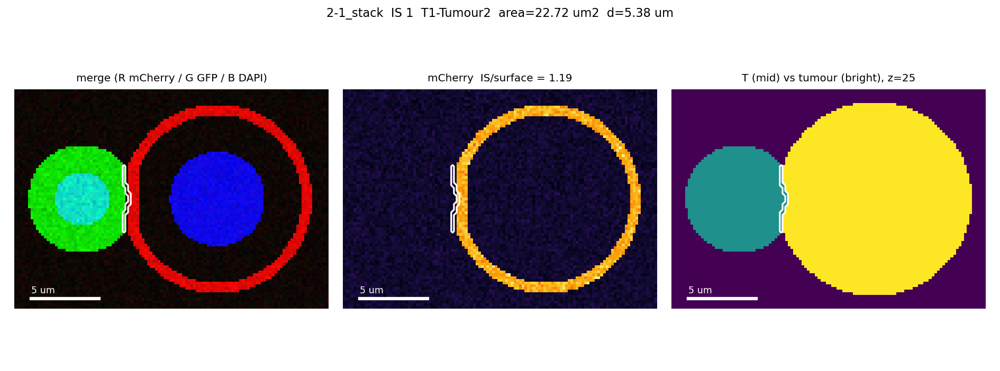
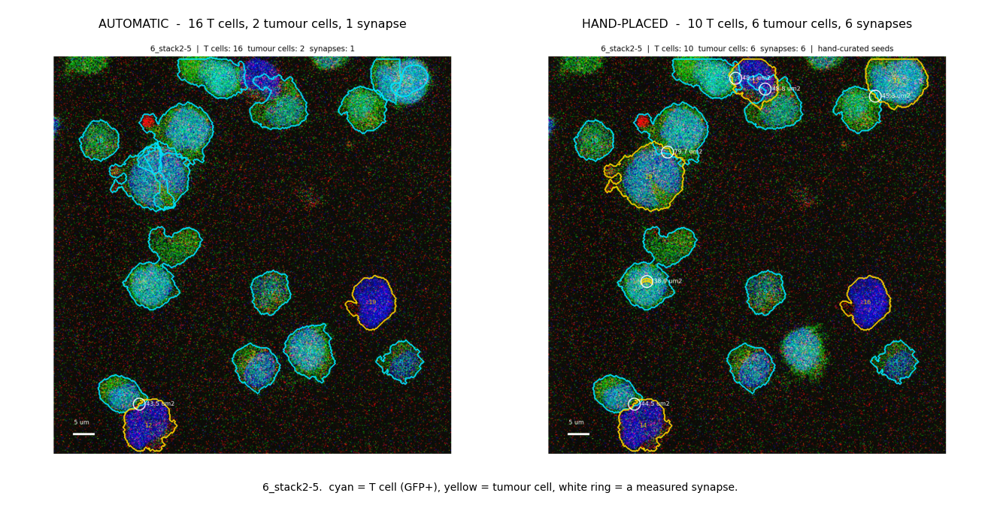
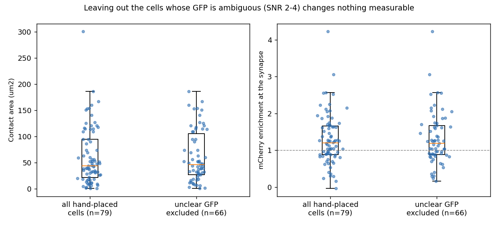
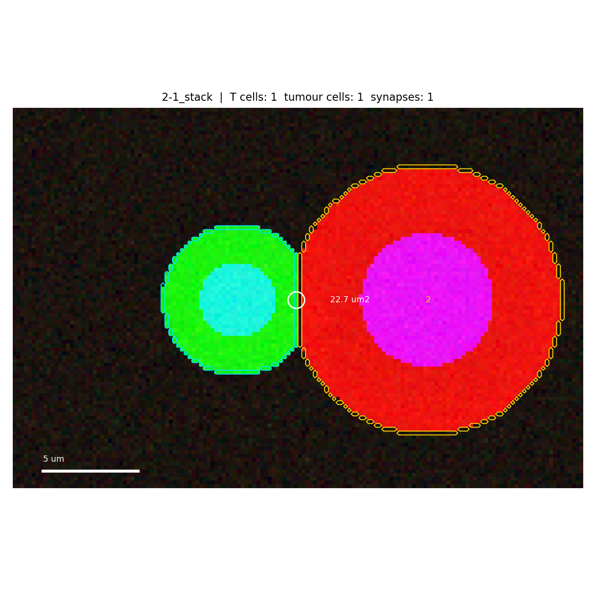

# Immunological synapse analysis (DAPI / GFP / mCherry confocal z-stacks)

A pipeline that finds every **T cell – tumour cell contact** in a confocal z-stack and measures
**how large that contact is**, together with how much of the **mCherry-stained antigen (BCMA)**
sits in it.

| cell type | how it is recognised |
|---|---|
| **Tumour cell** | DAPI+, GFP− ; its body is outlined by the mCherry antigen stain on its surface |
| **T cell** | DAPI+ **and** GFP+ ; GFP fills the cytosol, so the GFP+ volume *is* the T cell |
| **Immunological synapse (IS)** | the surface where a T cell body and a tumour cell body touch |



> **Three runs are kept side by side**: `results/` is the automatic one, `results_curated/` adds
> the hand-placed cells and is the primary result, and `results_curated_strict/` additionally
> leaves out the cells whose GFP is ambiguous, as a sensitivity check. The two comparisons are
> written up under **Correcting the cells by hand**.
>
> **Status.** This is a record of a method that was built and tested, not a finished study. The
> only images it has been run on (2026-06-04, see below) are replicates of a single condition —
> the comparison groups were never acquired, and the project ended before they could be. The
> statistics code is there and works, but nothing in this repository is a biological result.
> What is worth keeping is the measurement itself, its validation on synthetic data, and the
> list of things to fix in the next acquisition (bottom of this file).

## Why Python and not an ImageJ macro

The measurement is a **3D** one: splitting touching nuclei, growing each nucleus into a cell body,
and computing the area of the surface shared by two of those bodies. In the ImageJ macro language
that means leaning on 3D plugins (3D ImageJ Suite, MorphoLibJ) and still writing the contact-area
step yourself, with no straightforward way to script the per-condition statistics afterwards.
In Python, `scikit-image` and `scipy.ndimage` do the 3D work directly, and the whole study reruns
with one command when a parameter changes.

**ImageJ still does the two things it is best at**, and the repository ships macros for both:

| Step | Tool |
|---|---|
| Convert the microscope files into the `*_stack.tif` hyperstacks | [`tools/export_stacks.ijm`](tools/export_stacks.ijm) (Fiji, Bio-Formats) |
| Measure | `python scripts/run_analysis.py` |
| **Look at what was found, on the original image** | [`tools/view_synapses.ijm`](tools/view_synapses.ijm) (Fiji) |
| **Correct the cells by hand, then measure again** | [`tools/curate_seeds.ijm`](tools/curate_seeds.ijm) (Fiji) |

The pipeline also reads `.czi` directly, so the Fiji export step is optional.

## Usage

```bash
pip install -r requirements.txt
pip install -r requirements-cellpose.txt   # nucleus detection; pulls in torch (CPU is enough)
# put the *_stack.tif (or .czi) files in data/raw/, then
python scripts/run_analysis.py --data-dir data/raw
```

Cellpose is optional: `--nuclei watershed` falls back to a detector that needs nothing beyond
scikit-image, at the cost of accuracy (see below).

The image → condition mapping lives in [`metadata/samples.csv`](metadata/samples.csv); edit it for
your own experiment. Without it (`--samples none`) the condition is taken from the part of the
filename before the first `-` or `_`.

Useful options:

| Option | Default | Meaning |
|---|---|---|
| `--pattern` | `*_stack*` | which files to analyse (without the extension) |
| `--channels` | `0,1,2` | 0-based indices of DAPI, GFP, mCherry **in the order they were acquired** |
| `--voxel` | from file metadata | override `dz,dy,dx` in µm |
| `--snr` | `3.0` | how many robust SDs above background a voxel must be to count as stained |
| `--gfp-fraction` | `0.3` | GFP+ fraction around a nucleus needed to call it a T cell |
| `--nuclei` | `cellpose` | nucleus detector: `cellpose` (needs the extra install) or `watershed` (no extra dependency, less accurate) |
| `--nucleus-diameter-um` | `8.0` | typical nucleus diameter. **The parameter to tune first** for `--nuclei cellpose` |
| `--min-nucleus-fraction` | `0.075` | smallest nucleus kept, as a fraction of the volume of a sphere of `--nucleus-diameter-um`. A floor against single specks of noise; raising it to a real cut-off costs whole cells (see below) |
| `--min-separation-um` | `4.0` | smallest distance between two nuclear centres, `--nuclei watershed` only |
| `--split` | `shape` | where the border between two touching cells goes: the waist of their shared footprint (`shape`) or half-way between their nuclei (`nucleus`) |
| `--open-um` | `0.4` | isolated specks smaller than this are removed from the cell footprint |
| `--expand-um` | `0.0` | extra growth of each cell territory; raise to `0.3` if real contacts are missed |
| `--min-area-um2` | `0.5` | contacts smaller than this are not counted as a synapse |
| `--max-fraction-t` | `0.5` | a contact covering more than this fraction of the T cell surface is two cells inside one another; those pairs go to `excluded.csv` |
| `--unclear-gfp` | — | `LOW,HIGH` band of GFP brightness in which a hand-placed cell is typed `Unclear`: it keeps its seed but forms no synapse |
| `--curation` | — | folder of hand-made `{image}.csv` seed files; see **Correcting the cells by hand** |
| `--border` | `xy` | drop cells clipped by the sides of the field; `zyx` also drops cells clipped in z, `none` keeps everything |
| `--metric` | `Contact_Area_um2` | which column is plotted and tested |
| `--control` | first condition | reference group of the statistics |

## Seeing the result in Fiji

Run [`tools/view_synapses.ijm`](tools/view_synapses.ijm), point it at the analysed image and at
the `results` folder. It opens the image and loads `results/rois/{image}.zip` into the ROI
Manager, so the outlines are drawn on the raw data:

| colour | ROI name | what it is |
|---|---|---|
| cyan | `z07_T3` | body of T cell 3, in plane 7 |
| yellow | `z07_Tumour12` | body of tumour cell 12, in plane 7 |
| white | `z07_IS01` | the contact of synapse 1 — **exactly the voxels whose area was measured** |

The numbers match the `T_Cell`, `Tumour_Cell` and `IS` columns of `results/synapse_table.csv` and
the filenames in `results/per_synapse/`, so a row in the table, a figure and an outline on the
image all refer to the same object. Scrolling through z shows only the ROIs of the current plane;
selecting one ROI in the Manager shows that one alone.

The same information is also written as label stacks in `results/masks/` (`_bodies`, `_nuclei`,
`_synapses`), which can be opened directly in Fiji if you prefer a mask over an outline.

## Correcting the cells by hand

### Why this step exists

The automatic detection gets the cell **bodies** right once it has the right seeds — on synthetic
pairs the contact area lands within 3–40 % of the truth — and gets the **seeds** wrong in three
ways: one nucleus found twice, two nuclei found as one, or a tumour cell called a T cell because
its mCherry is too dim to see. [`docs/parameter-tuning.md`](docs/parameter-tuning.md) records
five attempts to repair those automatically — dropping undersized nuclei, merging them into their
neighbour, a larger and a per-cell-type Cellpose diameter, forcing GFP+ voxels out of tumour
bodies, and two ways of flagging the bad cells — **every one of which made the result worse**.

They all failed for the same reason. The DAPI channel has to be smoothed by 1 µm before the
nuclei can be detected at all, so the boundary between two touching nuclei is not in the image
any more; and the mCherry stain sits barely above background, so a tumour cell without a visible
antigen is indistinguishable from a T cell that happens to be dim. **That information is missing
from the data, not mis-handled by the code**, and no later step can recover it.

What a person can still do is look at the DAPI and say "that is one cell, and it is a tumour
cell". So the seeds, and only the seeds, are placed by hand: **one point per cell, plus what kind
of cell it is.** Everything else stays automatic and identical between the two runs.



This is `6_stack2-5`, the image where the two differ most. The same comparison for every image
is in [`docs/auto_vs_curated/`](docs/auto_vs_curated), with the counts side by side in
[`summary.csv`](docs/auto_vs_curated/summary.csv); rebuild them with
`python scripts/compare_runs.py`. The automatic run called six of the
blue DAPI-only cells T cells, because they have no detectable mCherry, so every contact they
make was a T–T pair and was discarded: **1 synapse instead of 6**. Over the whole set, hand
placement takes 60 synapses to 83 while the number of cells barely moves (T 15.6 → 15.1,
tumour 5.9 → 5.8 per image) — the contacts were not being missed for want of cells, but because
the cells on either side had been given the same type, or merged into one.

**This step would not be needed with better images.** A brighter DAPI exposure would keep the
boundary between two touching nuclei, and an mCherry stain that reaches `mCherry_SNR` ≥ 5 would
let the tumour cells be recognised on their own. Both are in **Next experiments** below. With
those, the automatic run should reproduce what was done here by hand, and the curation files
become a record rather than a requirement.

### How to do it

```bash
# 1. run normally; this also writes results/seeds/{image}.csv, the starting point
python scripts/run_analysis.py --data-dir data/raw

# 2. in Fiji: Plugins > Macros > Run... > tools/curate_seeds.ijm
#    pick the image folder, the results folder, and curation/ to save into. It then walks
#    through every image in turn, two rounds each (T cells, then tumour cells). The cells are
#    numbered circles on the image and rows in the ROI Manager beside it: click a cell and press
#    t to add one, select its row and press Delete to remove one. The plane does not matter -
#    each marker is placed at the brightest plane of its own DAPI column.

# 3. measure again from the corrected points, into a separate folder
python scripts/run_analysis.py --data-dir data/raw --curation curation --out results_curated
```

To go over your own work again, run the macro with **"skip images already corrected" unticked**.
An image that already has a file in `curation/` then starts from *those* cells rather than from
the automatic ones, so a second pass edits what you did last time. Each file is only rewritten
once both of its rounds are finished, so cancelling in the middle leaves the previous version
untouched.

An image with no file in `curation/` is detected automatically as before, so the two can be
mixed; the `Curated` column of the table says which rows came from hand-placed points. Keeping
the output in `results_curated/` leaves the automatic run in `results/` intact, so the two can be
compared and the repository keeps a record of what the program got wrong.

### Contacts that are not synapses

A hand-placed pair can still be two cells lying inside one another rather than touching.
`--max-fraction-t` (default 0.5) moves any pair whose contact covers more than that fraction of
the T cell's **whole** surface into `excluded.csv` instead of the table, with the reason. On this
set it removes 4 pairs, and they sit well clear of the rest.

### Cells whose GFP is ambiguous

The T cell line is a stable, single-cell-cloned Jurkat line, so in principle every T cell carries
GFP and the call should be easy. In practice about 7 % of the cells sit at an intermediate
brightness where it is not. Measuring every hand-placed cell's GFP in a 3 µm box, in robust SDs
over the image background:

| GFP SNR | cells | called T by hand | called tumour by hand |
|---|---|---|---|
| 0–2 | 56 | 3 | 53 |
| **2–4** | **28** | **17** | **11** |
| 4–6 | 85 | 66 | 19 |
| 6–10 | 147 | 136 | 11 |
| 10+ | 82 | 78 | 4 |

Outside the 2–4 band the two cell types separate cleanly (medians 7.7 and 1.3). Inside it the
hand calls are an even split at the same brightness — the image is not deciding it, so neither
can a person.

This is not an artefact of where the brightness is measured: repeating it inside each cell's own
segmented body rather than in a box around its centre gives the same picture (25 cells in the
band, 15 called T against 10 called tumour), so it is not GFP bleeding in from a neighbour above
or below. The cells really are intermediate. What makes them so is not settled — a dim or dying
cell, green autofluorescence in a tumour cell, or, if the GFP is the line's NFAT reporter rather
than a constitutive marker, a resting T cell that has not been activated. The last would matter
for more than this band, since GFP brightness would then track activation rather than identity.

`--unclear-gfp 2,4` therefore exists: a cell in that band is typed `Unclear`. It **keeps its
seed**, so the cells around it still get the right boundaries, but it never forms a synapse.
Dropping the point instead would let a neighbour absorb its body and spoil *that* cell's contact
as well.

**On this data it changes nothing measurable**, which is itself the useful result:

| | all hand-placed cells | unclear GFP excluded |
|---|---|---|
| synapses | 79 | 66 |
| cells typed `Unclear` | 0 | 1.3 per image |
| contact area, median | 44.2 µm² | 46.3 µm² |
| `Contact_Fraction_T`, median | 0.050 | 0.055 |
| **mCherry enrichment, median** | **1.20** | **1.19** |



The last row is the test that matters, because mCherry is an **independent** channel: if the
ambiguous cells were really tumour cells wrongly called T cells, removing them should leave a
cleaner set of true T–tumour pairs and raise the antigen enrichment at the synapse. It does not
(Mann-Whitney p = 0.99). The 13 synapses the filter removes also look like the ones it keeps —
median enrichment 1.21 against 1.19, the same `mCherry_SNR`, areas spread over the same range.

So the filter costs 16 % of the data and buys no measurable accuracy. **The full hand-placed set
in `results_curated/` is the primary result, and `results_curated_strict/` is the sensitivity
check** showing the numbers do not rest on the cells that were hard to call. Both are in the
repository. A brighter GFP exposure would narrow the band; what would settle it is a second,
constitutive marker for the T cells (or for the tumour cells), so that identity does not depend
on how brightly one channel happens to be expressed.

## The code, in the order it runs

| # | What happens | Where |
|---|---|---|
| 1 | **Collect and screen the files.** Glob `--pattern` over `--data-dir`, read each `.czi` / ImageJ `.tif` into a `[C, Z, Y, X]` array and take the voxel size from its metadata. Files with fewer than 4 z planes (overview tiles, single snapshots) are skipped, and `--channels` is checked against the file | [`io.py`](is_analysis/io.py) `list_stacks`, `load_stack`; [`pipeline.py`](is_analysis/pipeline.py) `analyse_image` |
| 1b | **Or take the cells from a curation file**, if `--curation` is given and the image has one: one point per cell with its type, each placed at the brightest plane of its own DAPI column. Steps 2 and 3 are then skipped | [`curation.py`](is_analysis/curation.py) `read_points`, `seeds` |
| 2 | **Find the nuclei (DAPI).** The channel is smoothed by 1 µm — raw, it is too grainy for the model — and the Cellpose `nuclei` model is run plane by plane at `--nucleus-diameter-um`, then stitched in z. `--nuclei watershed` instead thresholds the channel and splits touching nuclei on the distance map | [`nuclei.py`](is_analysis/nuclei.py) `cellpose_nuclei`, `watershed_nuclei` |
| 3 | **Decide what each nucleus is.** Fraction of GFP+ voxels in a 1 µm shell around it; above `--gfp-fraction` it is a T cell, otherwise a tumour cell | `segmentation.py` `classify` |
| 4 | **Grow the nuclei into cell bodies.** The cell footprint is every channel at once — DAPI, GFP and mCherry at their **half-maximum** level (see below), each hole-filled on its own so that a hollow surface stain becomes a solid body, then combined. Two cells that touch share one blob, which is cut at its **waist** (watershed on the distance transform of the footprint, seeded by the nuclei) | `segmentation.py` `cell_bodies`, `half_max`, `fill` |
| 5 | **Drop the cells that cannot be measured**: those clipped by the sides of the field. Cells clipped by the first or last z plane are kept and flagged `Clipped_Z` | `pipeline.py` `analyse_image`, `segmentation.clipped` |
| 6 | **Find the contacts.** One pass over the three face directions gives every pair of touching bodies and a first area estimate; T–T and tumour–tumour pairs are discarded | [`synapse.py`](is_analysis/synapse.py) `contact_pairs`, `interface_mask` |
| 7 | **Measure each synapse.** Area from a marching-cubes mesh of the T cell, taking the triangles that face the tumour cell; plus the contact extents, the cell volumes and surfaces | `synapse.py` `contact_area_mesh`, `surface_area`, `extents_um` |
| 8 | **Measure the antigen.** mCherry in a ±0.5 µm band on the tumour surface, at the synapse vs. over the rest of that surface, both background-subtracted | `synapse.py` `antigen_at_synapse`, `segmentation.background` |
| 9 | **Write the per-image output**: label stacks, ImageJ ROIs, the QC projection and one figure per synapse | `pipeline.py` `_write_masks`; [`rois.py`](is_analysis/rois.py) `write`; [`plotting.py`](is_analysis/plotting.py) `plot_image_qc`, `plot_synapse` |
| 10 | **Pool everything**: attach the conditions, write the table, run the group statistics and the final plot | `pipeline.py` `_conditions`, `group_stats`, `plotting.plot_groups` |

### Where the boundary of a cell is put

A fluorescent edge is blurred by the microscope, so a "background + 3 SD" threshold sits a few
hundred nm *outside* the real boundary and inflates every cell. The body masks therefore use the
**half-maximum level** — half-way between the background and the stained signal — which is where a
blurred step actually crosses its own mid-point. On the synthetic test below this brings the cell
volumes to within ~20 % of the truth instead of ~80 % too large.

### Where the border between two touching cells is put

Two cells in contact share one blob of foreground, and the border has to be guessed. The default
`--split shape` cuts the blob at its **waist**: a watershed on the distance transform, seeded by
the nuclei, which puts the border where the shared outline pinches in — where two cells pressed
together actually meet, regardless of their relative size. `--split nucleus` instead puts it
half-way between the two nuclei, which is more stable in very noisy images but pushes the border
into the larger of the two cells.

Neither is a membrane. This is the weakest assumption in the pipeline, and a membrane stain would
replace it outright.

### Cells clipped in z

Cells clipped by the **sides** of the field are dropped, since their volume and surface are not
measurable. Cells clipped by the **first or last z plane** are kept but flagged in the `Clipped_Z`
column: a stack only a little deeper than a cell clips most cells in z, so dropping them would
throw away the experiment. Their volume and surface are underestimated, so filter on `Clipped_Z`
before reading `Contact_Fraction_T` or the volumes. `--border zyx` drops them instead.

### Background

mCherry is detected with an antibody, so there is a diffuse background. It is estimated **per
image** as the median of the voxels more than 2 µm away from any detected cell, and subtracted
from every mCherry number. `mCherry_SNR` (tumour surface signal / background noise) is reported
per synapse — if it is close to 1, the staining failed in that image and its antigen numbers mean
nothing. The *contact area* does not depend on the mCherry level, only on the segmented boundary.

## Outputs (`results/`)

| File | Description |
|---|---|
| `synapse_table.csv` / `.xlsx` | **one row per T cell – tumour cell contact**, pooled over all images |
| `per_synapse/{image}_IS01.png` | the contact plane of one synapse: merge, mCherry, the two cell bodies, contact outlined in white |
| `segmentation_qc/{image}.png` | projection with every cell outlined (cyan = T cell, yellow = tumour) and every synapse marked |
| `rois/{image}.zip` | the same outlines as ImageJ ROIs, for `tools/view_synapses.ijm` |
| `seeds/{image}.csv` | one point per detected cell with its type — the starting point for `tools/curate_seeds.ijm` |
| `masks/{image}_bodies.tif`, `_nuclei.tif`, `_synapses.tif` | the label stacks, ImageJ-readable |
| `excluded.csv` | pairs removed by `--max-fraction-t`, with the reason — kept so nothing disappears silently |
| `group_stats.csv` | per condition: n, median, mean, Mann-Whitney p vs the control |
| `synapse_size.png` | the final box plot |



### Columns of `synapse_table.csv`

| Column | Meaning |
|---|---|
| `IS` | synapse number within the image — the same number as the ROI and the figure |
| `Contact_Area_um2` | **the IS size**: area of the shared surface, from the marching-cubes mesh |
| `Contact_Diameter_um` | diameter of a circle of that area (`2·√(A/π)`) |
| `Contact_Length_um`, `Contact_Width_um` | the two largest principal extents of the contact patch |
| `Contact_Fraction_T` | contact area ÷ total T cell surface — the size-independent version of the metric |
| `Contact_Area_Voxelface_um2` | the same area counted as voxel faces, as an independent cross-check |
| `T_Volume_um3`, `Tumour_Volume_um3`, `T_Surface_um2` | cell geometry |
| `mCherry_IS`, `mCherry_TumourSurface` | background-subtracted antigen in the surface band, at the synapse and elsewhere |
| `mCherry_Enrichment` | their ratio; > 1 = antigen concentrated at the synapse |
| `mCherry_Background`, `mCherry_SNR` | staining quality of that image |
| `N_T_Cells`, `N_Tumour_Cells`, `N_Unclear_Cells` | cells kept in that image, i.e. how crowded the field was |
| `Curated` | the two cells came from hand-placed points rather than from automatic detection |
| `Clipped_Z` | one of the two cells reaches the first or last z plane, so its volume and surface are truncated |

**`Contact_Fraction_T` is usually the fairer comparison**: a bigger T cell makes a bigger contact
without being any more activated, and this column divides that out.

## How the parameters were chosen

[`docs/parameter-tuning.md`](docs/parameter-tuning.md) is the record: every setting in the table
above, what it was measured against, and — more usefully — the four reasonable-looking changes
that made the result *worse* and were backed out (dropping undersized nuclei as debris, merging
them into their neighbour, a larger or a per-cell-type Cellpose diameter, forcing GFP+ voxels out
of tumour bodies, and two ways of flagging the cells where two nuclei were detected as one).
Read it before changing a default.

## Validation

`scripts/make_test_data.py` builds synthetic pairs — two spheres flattened against a common plane,
with a thin gap, a surface antigen rim, a diffuse antibody background and Poisson noise — so the
true contact area is exactly π·r². `scripts/validate.py` runs the whole pipeline on them:

```bash
python scripts/validate.py --dz 0.4
```

| true area (µm²) | measured, dz = 0.4 µm | measured, dz = 1.0 µm | true contact diameter (µm) | measured `Contact_Length_um`, dz = 0.4 / 1.0 |
|---|---|---|---|---|
| 7.07 | 9.90 (×1.40) | 7.66 (×1.08) | 3.0 | 3.2 / 2.8 |
| 19.63 | 21.92 (×1.12) | 21.53 (×1.10) | 5.0 | 4.9 / 4.8 |
| 38.48 | 39.49 (×1.03) | 38.31 (×1.00) | 7.0 | 6.8 / 6.4 |

Cell volumes come out within ~20 % (T cell 268 µm³ true, 219–267 measured; tumour 1437 µm³ true,
1487–1543 measured).

So: **`Contact_Area_um2` is accurate to a few per cent for a contact of a few µm across, and up
to ~40 % too large for the smallest ones** — the segmented
boundary cannot be more precise than the point spread function, and a contact is the small
difference between two large surfaces. The ranking between conditions is preserved, which is what
a comparison needs. `Contact_Length_um` tracks the true contact diameter to within ~0.5 µm and is
the least biased single number here.

Run `python scripts/validate.py` after changing anything in `is_analysis/`.

## What was run: the 2026-06-04 co-culture set

All of these are **replicates of one condition**; there is no comparison group. The run exists to
show the pipeline end to end, not to support a conclusion.

That acquisition stores the channels as **R-PE (mCherry), EGFP, DAPI**, so the channel order has
to be given explicitly, and the `1_stack*` files have no GFP channel at all (DAPI, mCherry, ESID)
and must be left out:

```bash
python scripts/run_analysis.py \
  --data-dir "<.../20260604/63x>" --pattern "[456]_stack*" --channels 2,1,0 --samples none
```

The `5_stack.czi` / `5_stack1.czi` overview tiles are single planes and are skipped automatically.
Of the 18 stacks, 15 contained at least one contact: 52 in total, median `Contact_Area_um2`
≈ 50 µm² with a wide spread (IQR 18–97 µm²). What that spread comes from is the next section.

## Next experiments

### 1. Acquire deeper stacks with a finer z step

The 2026-06-04 stacks are 13–21 planes at dz = 1 µm, i.e. 13–21 µm of depth for cells that are
10–15 µm across, so **every single cell was flagged `Clipped_Z`**. A truncated cell has a
truncated surface and a truncated contact, which makes `T_Volume_um3` and `Contact_Fraction_T`
unusable and leaves the contact area dependent on where the stack happened to start.

Next time:

- start the stack ~5 µm below the lowest cell and end ~5 µm above the highest, so whole cells fit;
- **dz ≤ 0.4 µm** at 63×. The Nyquist step for a 1.4 NA objective is ~0.3 µm, and the antibody rim
  on the tumour surface is only ~0.8 µm thick, so 1 µm barely samples it;
- keep dz identical across every condition that will be compared — the measured area depends on it;
- then check that `Clipped_Z` is `False` for most rows. That is the one-line test that this is fixed.

Raise the **DAPI** exposure in the same pass. At the moment the channel has to be smoothed by
1 µm before the nuclei can be detected at all, which erases the boundary between two touching
nuclei — the reason the cells had to be placed by hand on this set.

### 2. Get the mCherry (BCMA) staining above background

`mCherry_SNR` had a median of ~1.7 across the run, and in some fields (e.g. `4_stack1`) the
mCherry channel was essentially empty, so no tumour cell was detected at all and the field
contributed nothing. At that level `mCherry_Enrichment` is noise, and the tumour body falls back
to a 1.5 µm shell around the nucleus, which also distorts the contact area.

What to do before the next imaging session:

- image a **stained and an unstained (secondary-only) well with identical settings**, and compare
  the median tumour-surface intensity with the median background. Aim for the stained surface at
  **≥ 5× the background SD** — the pipeline reports exactly this number as `mCherry_SNR`, so it
  can be checked on a single test image before committing to a full session;
- if that is not reached, titrate the primary antibody and improve the blocking and washing before
  reaching for more laser power — the background here is diffuse antibody, not detector noise, so
  more gain raises signal and background together and `mCherry_SNR` does not improve;
- reaching `mCherry_SNR` ≥ 5 would also let a tumour cell be recognised on its own. On this set
  the dim ones were called T cells, which is most of why the cells had to be placed by hand;
- include a **BCMA-negative tumour line** in the same session. It gives the true floor of
  `mCherry_IS`, which is what the enrichment ratio should be judged against;
- if the antigen stays dim, add a general membrane or cytoplasmic stain for the tumour cells. The
  tumour body would then no longer depend on the antigen channel at all, which is the single
  biggest structural weakness of the current segmentation.

### 3. Separate a real synapse from two cells that merely touch

The pipeline currently calls **every** T cell / tumour cell contact a synapse. In the run, 6 % of
rows had `Contact_Fraction_T > 0.25` — cells wrapped around each other, where the measured
"contact" is a long irregular boundary set by the shape of the clump rather than by a membrane.
Dropping those barely moves the median (50 → 49 µm²), so this is no longer about a few outliers:
the whole distribution mixes focal contacts with incidental apposition, and nothing in the data
separates them.

Ideas, roughly in order of effort:

- **a size filter — done.** `--max-fraction-t` now removes pairs whose contact covers more than
  half of the T cell's surface, into `excluded.csv`. On the hand-placed set that is 9 pairs, well
  separated from the rest. It catches cells lying inside one another, not the harder question of
  whether a genuine contact is a synapse;
- **a compactness criterion.** A mature synapse is a flat, roughly circular patch, so
  `Contact_Length_um / Contact_Width_um` near 1 and `Contact_Area_um2` close to
  `π·(Contact_Length_um/2)²`. An interlocking clump fails both. Those columns already exist — the
  ratio just needs to be computed and looked at;
- **a molecular criterion**, which is the one that actually defines a synapse. Stain for F-actin
  (phalloidin) or phospho-tyrosine, or a CAR-clustering readout, and require enrichment at the
  contact. The `antigen_at_synapse` function already measures exactly this for mCherry, so a
  fourth channel can reuse it as is;
- **a time course.** A conjugate that persists over minutes is a synapse; a chance apposition is
  not. This needs live imaging rather than fixed stacks, and would be a different pipeline.

Until one of these is in, read `Contact_Area_um2` as "how much of these two cells is in contact",
not as "synapse size".

## Statistical caveat: the p-values are overestimated

The significance marks (Kruskal-Wallis across conditions, Mann-Whitney U vs. the control) treat
**each synapse as an independent observation**. It is not: synapses from the same image, field and
dish share culture, staining and imaging conditions, and several synapses can even involve the
same T cell. This is **pseudoreplication**, so the effective sample size is much smaller than the
number of rows and the **p-values are too small (anti-conservative)**.

Read `*`, `**`, `***` as exploratory. A rigorous test needs independent biological replicates
(dish/well), with either the replicate mean as the unit of analysis or a mixed-effects model with
image/dish as a random effect.

## Known limitations

- **Only contacts that are in the stack are found.** A cell clipped by the side of the field is
  dropped, so synapses at the edge are missed and n is smaller than what the eye counts.
  Cells clipped in z are kept but their volume and surface are truncated (`Clipped_Z`).
- **Tumour bodies depend on the mCherry stain.** Where the antibody signal is weak the tumour body
  falls back to a 1.5 µm shell around the nucleus and its contact is then underestimated. Check
  `mCherry_SNR` and the figures in `segmentation_qc/` before trusting an image.
- **GFP classification is a threshold.** A dim GFP+ T cell is called a tumour cell; check
  `segmentation_qc/` (cyan vs. yellow outlines) and tune `--gfp-fraction` if the colours are wrong.
- **Crowded fields are the hard case.** Where cells are packed, the border between two cells is
  drawn at the waist of their shared outline, not at a membrane, so both the cell shapes and the
  contact are only as good as that guess.
- **Everything rests on the nucleus detection**, because one seed per cell is what keeps two
  cells apart. A missing seed makes a cell disappear into its neighbour and turns their contact
  into a sliver; a duplicated one cuts a cell in half and reports one contact as several. Check
  `segmentation_qc/` for cells with a line drawn through them, or for two cells inside one
  outline, and tune `--nucleus-diameter-um`.
- **Undersized nuclei cannot be filtered out here.** A fifth of the detections come out below
  20 % of the expected nucleus volume, and it is tempting to drop them as debris or dead cells.
  Checked one by one they are not: some are nuclei Cellpose drew a little small, and the rest
  are cells sitting above or below another cell — their outlines overlap in x and y but they are
  five to nine planes apart in z. Dropping them cost 7 of 60 synapses and *raised* the largest
  contact from 194 to 263 µm², because a cell whose only seed is gone has no marker left and the
  watershed hands its body to its neighbour. `--min-nucleus-fraction` is therefore left at a
  noise floor. A brighter DAPI exposure would make the nucleus sizes trustworthy enough for a
  real cut-off.
- **The DAPI channel is smoothed by 1 µm before Cellpose sees it.** At this photon count the raw
  channel is grainy enough that the model finds almost nothing on it — 5 nuclei in a field of
  about 25. Smoothing makes the nuclei recognisable, but it also blurs their real edges, so the
  nucleus masks come out slightly small and round. That does not affect the contact areas, which
  are measured on the cell bodies and not on the nuclei, but it does mean the nucleus shapes in
  `masks/*_nuclei.tif` should not be used as a measurement. A brighter DAPI exposure would remove
  the need for the smoothing.
- The raw microscopy files are not tracked in git (~40 MB per image, see `.gitignore`). The
  **analysis output is**: `results/` in this repository is the complete output of the
  2026-06-04 run, so the figures, the ROIs and the table can be read without re-running anything.
  The label stacks are LZW-compressed, which Fiji opens normally.
